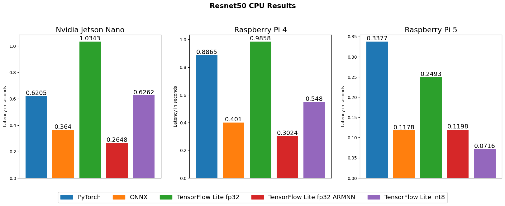
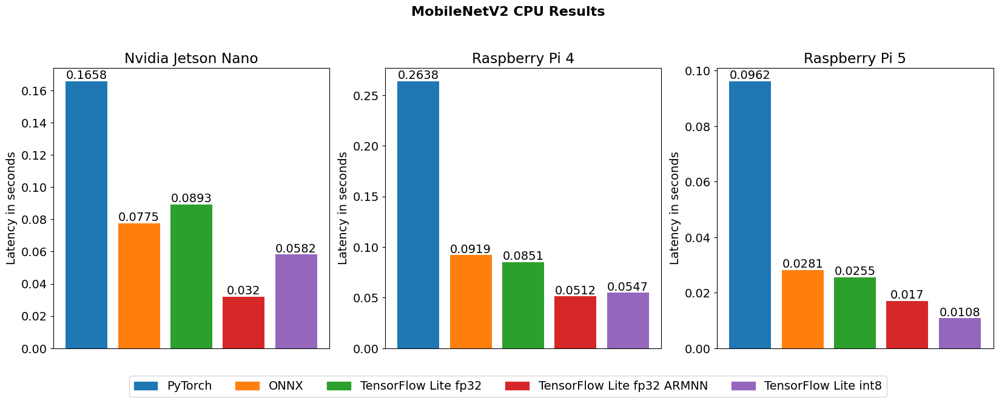
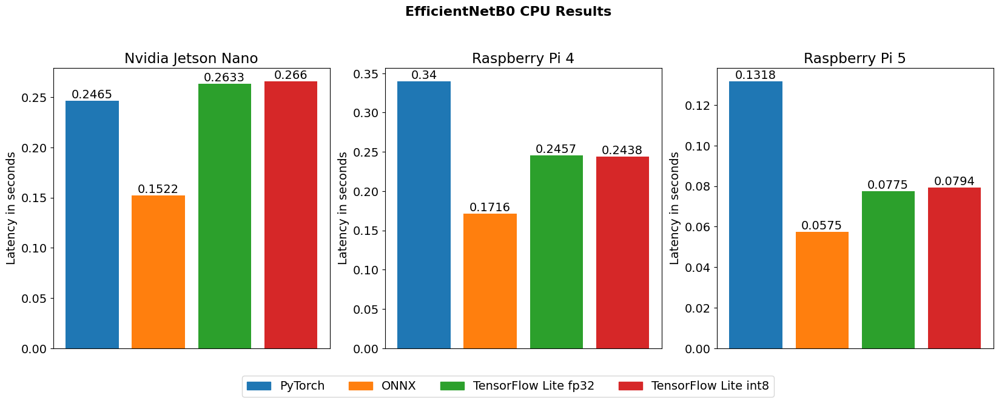
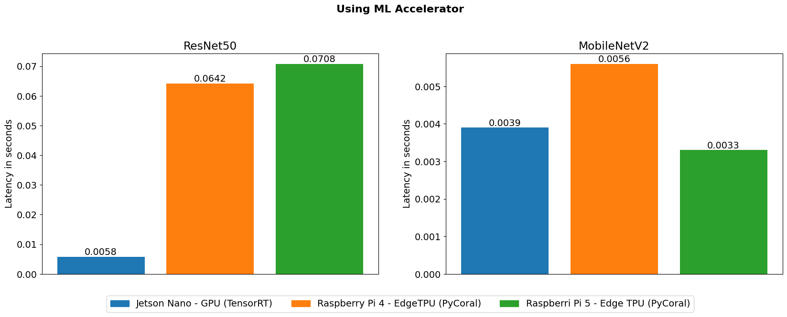

# Deep Learning models benchmarking tool for single-board microcomputers of ARM architecture
Benchmark designed to evaluate performance of Deep Learning models on single-board microcomputers of ARM architecture
Currently the following platforms are supported:
* Nvidia Jetson Nano
* Raspberry Pi 4 Model B
* Raspberry Pi 5
* Google Coral USB Accelerator connected to Raspberry Pi 4 or Raspberry Pi 5

It can evaluate performance using the following frameworks:
* PyTorch
* ONNX
* TensorFlow Lite
* TensorRT

The following optimizations are possible:
* Full-integer quantization of TensorFlow Lite model
* ARM NN TFLite delegate
* Compiling model for usage on Edge TPU

It measures the following metrics:
* Latency    (inference time)
* Accuracy   (classification models)
* Precision  (classification models)
* Recall     (classification models)
* F1-Score   (classification models)
* MAPE       (regression models)
* MSE        (regression models)

The benchmark works only with models with single input and output and sets its batch size to 1 during conversions.

The following model conversions are possible:

|      From/To    | PyTorch | ONNX | TensorFlow | TensorFlow Lite | TensorRT |
| --------------- | ------- | ---- | ---------- | --------------- | -------- |
|      PyTorch    |         |   +  |     +      |        +        |     +    | 
|       ONNX      |    -    |      |     +      |        +        |     +    | 
|   TensorFlow    |    -    |   -  |            |        +        |     -    |   
| TensorFlow Lite |    -    |   -  |     -      |                 |     -    | 
|     TensorRT    |    -    |   -  |     -      |        -        |          | 

## Environment
Benchmark was tested using **Python 3.9**. PyCoral API is not compatible with newer versions. 

You can create virtual environment and install all packages except TensorRT using `setenv.py` script:
```bash
$ python3 setenv.py --all
```
It is also possible to install only needed packages using --origin-fr and --target-fr arguments:
```bash
usage: setenv.py [-h] [--origin-fr {pytorch,onnx,tensorflow,tflite,tensorrt,coral}] [--target-fr {onnx,tflite,tensorrt,coral}]
                 [--all]

Usage of setenv.py

options:
  -h, --help            show this help message and exit
  --origin-fr {pytorch,onnx,tensorflow,tflite,tensorrt,coral}
                        Specify only this if you already have converted model and want just to evaluate it
  --target-fr {onnx,tflite,tensorrt,coral}
                        Specify this and --origin-fr if you want to install dependencies that will be needed to convert model from
                        --origin-fr to --target-fr and measure performance
  --all                 Install all dependencies
```

If want to use ARMNN delegate install pre-built binaries from source: https://github.com/ARM-software/armnn/releases

If using Nvidia Jetson Nano, separate virtual environment must be manually created and TensorRT installed there. It is not done in `setenv.py` because Jetson Nano has old software and in most cases it should be built from sources.
Tested TensorRT version: 8.2.1.9


## Performance measurement
To convert model to target framework if needed and measure its performance use `evaluate.sh`. In case you are using custom venv in Jetson Nano with TensorRT call just `evaluate.py`.
Example of usage with every framework except compiling for Coral, all parameters are explained the next section:
```bash
# Firstly run
$ chmod +x evaluate.sh
# PyTorch
$ ./evaluate.sh resnet50.pth data.npz pytorch --model-class-path model_class.py --model-class-name ResNet50
# Pytorch -> ONNX or TFLite or TensorRT
$ ./evaluate.sh resnet50.pth data.npz [onnx, tflite, tensorrt] --model-class-path model_class.py --model-class-name ResNet50
# ONNX, ONNX -> TFLite, TensorRT
$ ./evaluate.sh resnet50.onnx data.npz [onnx, tflite, tensorrt]
# TensorFlow -> TFLite
$ ./evaluate.sh resnet50 data.npz [onnx, tflite, tensorrt]
# TensorFlow -> TFLite with full-integer quantization. The same parameters could be used in previous
# commands where converting to tflite to apply quantization
$ ./evaluate.sh resnet50 data.npz tflite --quantization --representative-data-path repr_data.npz
# TFLite with ARM NN. The same parameters could be used in previous
# commands where converting to tflite to use ARM NN
$ ./evaluate.sh resnet50.tflite data.npz tflite --use-armnn
```
Input data requirements:
* data must be provided only as *.npz file
* it must consist of x_data, y_data exactly in this order
* x_data must be array of inputs without batch dimention. Benchmarking tool will do inference with batch size 1
* If given model is quantized, original float data could be given. It will be converted to int8 during performance measurement

It is also possible just to convert model without measuring performance by using `--convert-only`

When sing Edge TPU, model needs to be quantized and then compiled with `edgetpu_compiler`. See here: https://coral.ai/docs/edgetpu/compiler/
After that just run:
```bash
$ ./evaluate.sh resnet50_edgetpu.tflite data.npz coral
```
To test benchmark there is ResNet50 model and preprocessed images in `test_data`

## Script parameters
```bash
usage: evaluate.py [-h] [--use-armnn] [--armnn-path ARMNN_PATH] [--use-softmax] [--model-type {classification,regression}]
                   [--model-class-path MODEL_CLASS_PATH] [--model-class-name MODEL_CLASS_NAME] [--do-not-keep-shape]
                   [--transposed-data-path TRANSPOSED_DATA_PATH] [--convert-only] [--quantization]
                   [--representative-data-path REPRESENTATIVE_DATA_PATH]
                   model_path data_path {pytorch,tflite,onnx,tensorrt,coral}

Usage of evaluate.sh:

positional arguments:
  model_path            Path to the model file
  data_path             Path to the data file
  {pytorch,tflite,onnx,tensorrt,coral}
                        The framework that will be used to test the model

options:
  -h, --help            show this help message and exit
  --use-armnn           Use ARM NN delegate to speed up inference on ARM architecture CPU. Works only with float32 TFLite model
  --armnn-path ARMNN_PATH
                        Path to ARM NN delegate
  --use-softmax
  --model-type {classification,regression}
                        Type of the model: classification or regression
  --model-class-path MODEL_CLASS_PATH
                        If using Pytorch this must be set. Path to file with model architecture (class)
  --model-class-name MODEL_CLASS_NAME
                        If using Pytorch this must be set. Name of class of model architecture
  --do-not-keep-shape   By default when converting model from onnx to tensorflow the input shape is kept by adding Transpose in the
                        begginig, because PyTorch and ONNX mostly uses CHW input shape, while TensorFlow uses HWC. Set this to not
                        keep shape. If set --transposed-data-path must also be provided
  --transposed-data-path TRANSPOSED_DATA_PATH
                        Path to transposed data. It must be set if using -do-not-keep-shape
  --convert-only        Do not measre performance, only convert model to provided framework
  --quantization        Use full-integer quantization. If model is not quantized then --representative-data-path must be also
                        provided. If using already quantized model just set --quantization
  --representative-data-path REPRESENTATIVE_DATA_PATH
                        Path to representative dataset for full-integer quantization. It could be the subset of training data
                        around 100-500 samples
```

## Quantization problems
When converting model from PyTorch or ONNX to TensorFlow Lite and using full-integer quantization there could be very big accuracy drop.
More about what is causing it could be found here https://pypi.org/project/onnx2tf/1.19.16/#:~:text=7.%20If%20the%20accuracy%20of%20the%20INT8%20quantized%20model%20degrades%20significantly

So it is recommended to use the original TensorFlow models for full-integer quantization to avoid this problems.


## Experiments
Some experiments were done using a benchmark. We measured performance on all supported devices with all supported frameworks for such models: ResNet50, MobileNetV2, EfficientNetB0. Here are obtained results:






